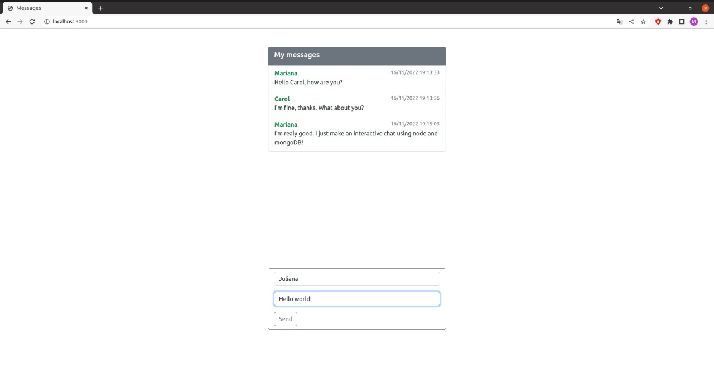

# node-chat
> Simple chat that show the messages sent on real time. This program was made to improove my habilities with Node.js

## Table of Contents
* [General Info](#general-information)
* [Technologies Used](#technologies-used)
* [Screenshots](#screenshots)
* [Setup](#setup)

## What does the website provide?
- List of the messages sented
- Create messages at mongoDB

## Technologies Used
- node.js v16
- express v4.18.2
- mongoose v6.7.0
- dotenv v16.0.3
- nodemon v2.0.20
- body-parser v1.20

## Screenshots




## Setup
First, you must have npm and node installed. If you already have it, you can just write

```bash
npm install
```
And then run the project with

```bash
npm run dev
```

Don't forget to create your .env file with your db credentials. You can follow the exemple at .envexample
